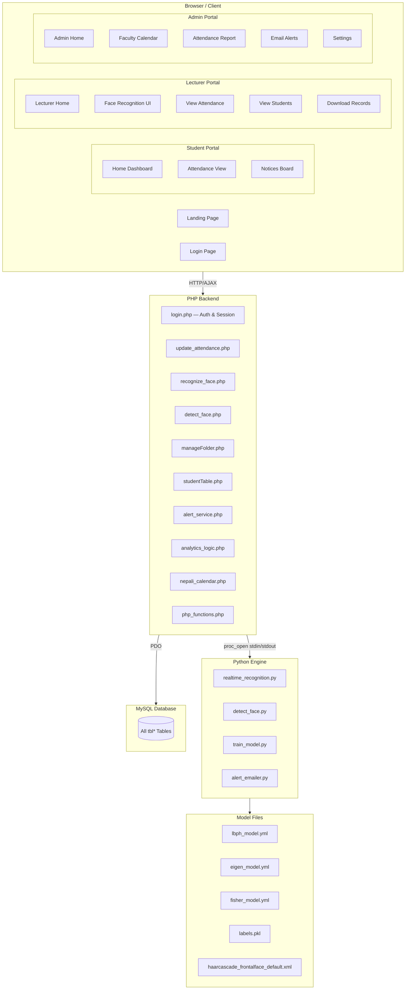
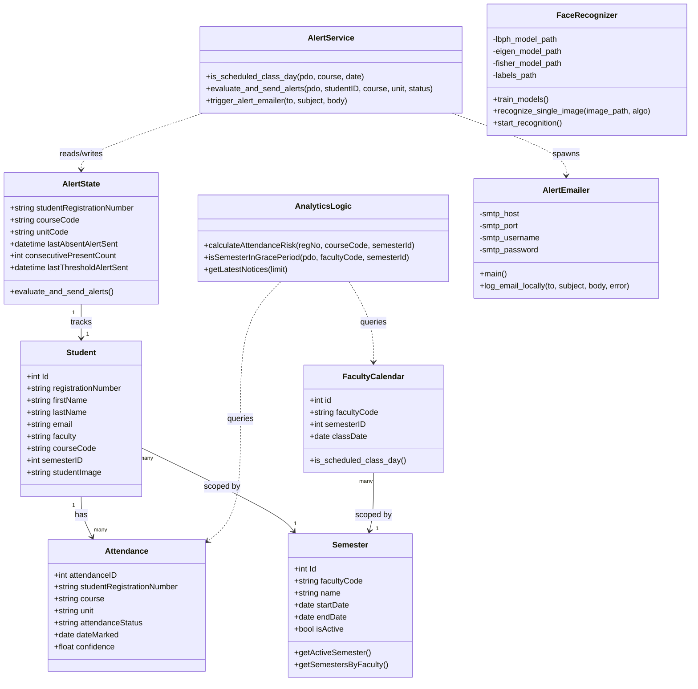
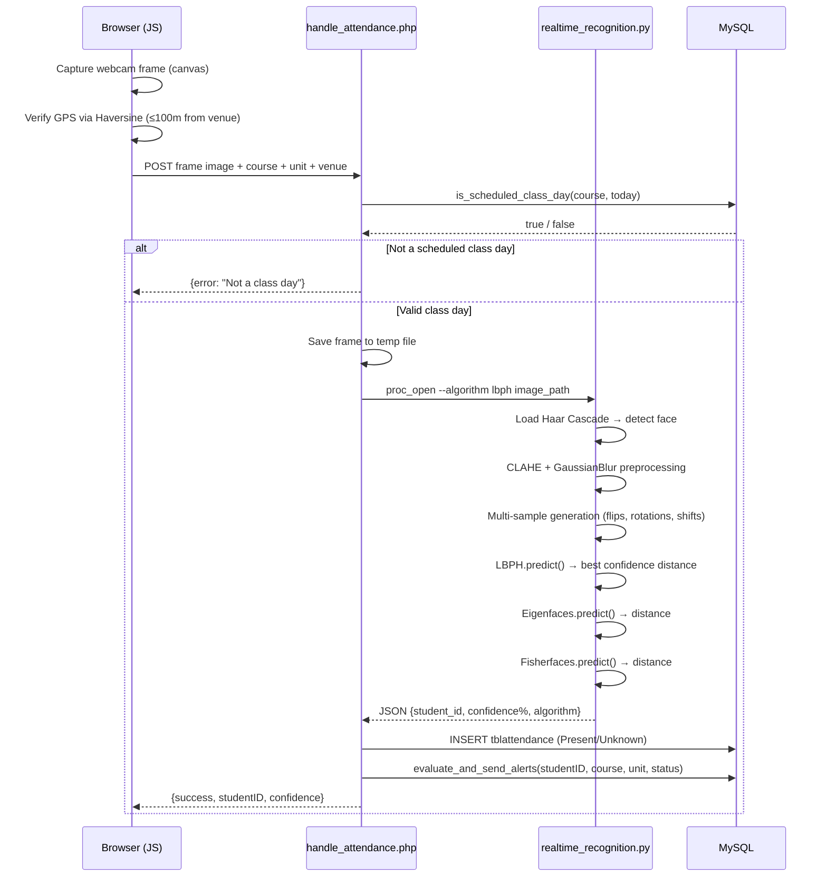
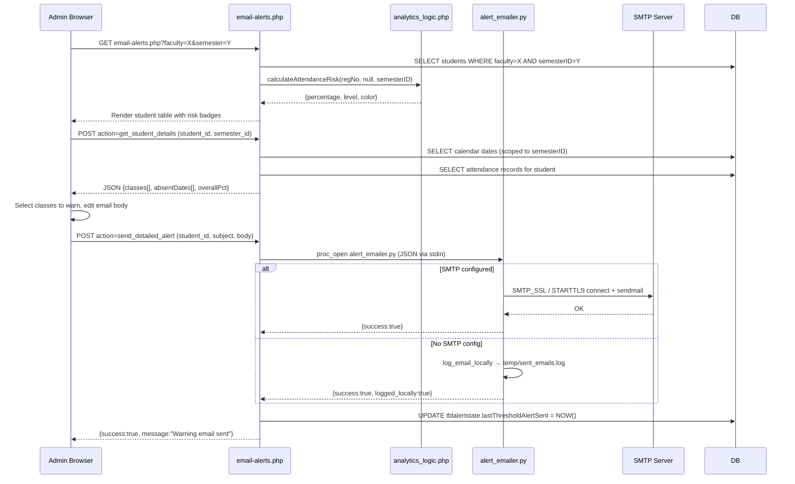
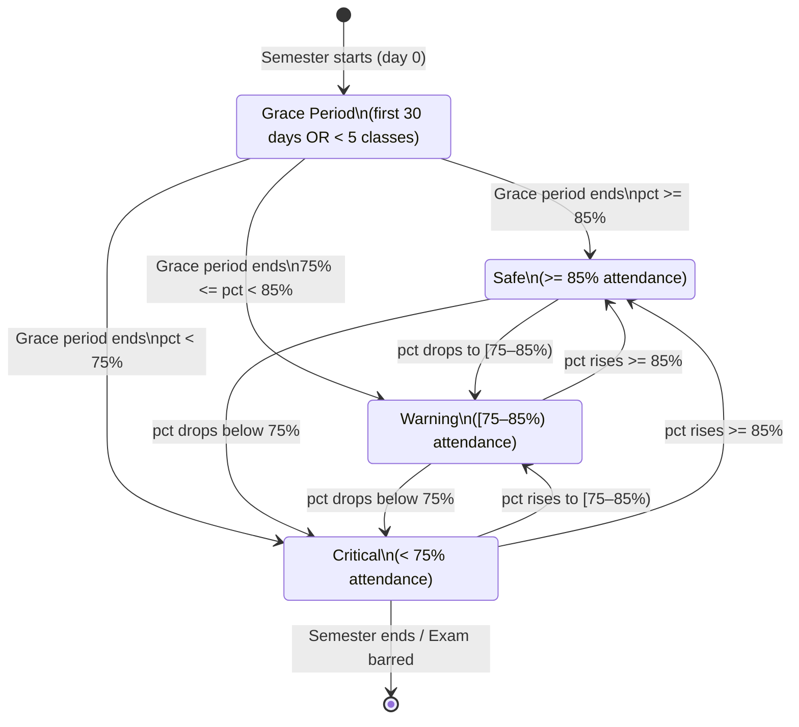
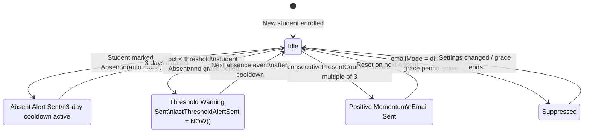
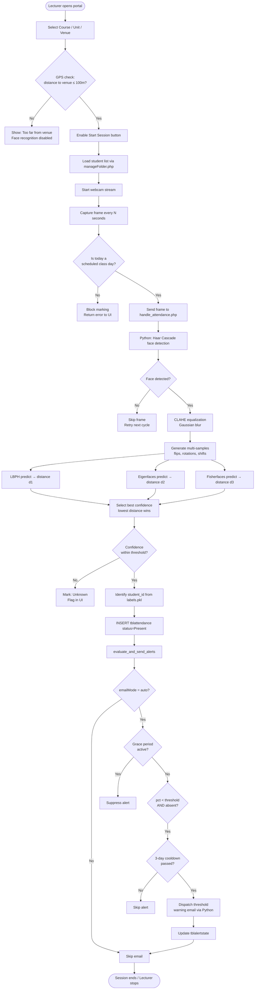
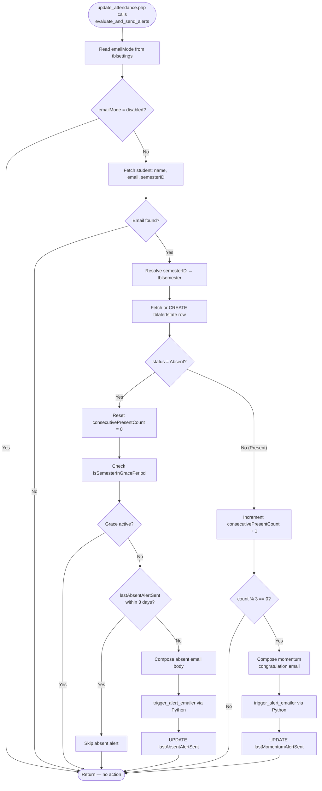

# SAS Attendance System — Full Architecture & Algorithm Reference

---

## 1. Backend Database Schema

```sql
-- Core Tables (with runtime migrations applied via database_connection.php)

tbladmin          : Id, firstName, lastName, emailAddress, password(bcrypt)
tblfaculty        : Id, facultyName, facultyCode, dateRegistered
tbllecture        : Id, firstName, lastName, emailAddress, password(bcrypt), phoneNo, facultyCode
tblcourse         : Id, name, facultyID→tblfaculty, courseCode, dateCreated
tblunit           : Id, name, unitCode, courseID→tblcourse, dateCreated
tblvenue          : Id, className, facultyCode, currentStatus, capacity, classification, dateCreated
tblstudents       : Id, firstName, lastName, registrationNumber, email, faculty→tblfaculty,
                    courseCode→tblcourse, semesterID→tblsemester, studentImage, dateRegistered
tblattendance     : attendanceID, studentRegistrationNumber→tblstudents, course→tblcourse,
                    unit→tblunit, attendanceStatus, dateMarked, confidence(float)
tblsemester       : Id, facultyCode→tblfaculty, name, startDate, endDate, isActive, dateCreated
tblfacultycalendar: id, facultyCode→tblfaculty, semesterID→tblsemester, classDate, description
                    UNIQUE(facultyCode, semesterID, classDate)
tblalertstate     : id, studentRegistrationNumber, courseCode, unitCode,
                    lastAbsentAlertSent, consecutivePresentCount,
                    lastMomentumAlertSent, lastThresholdAlertSent
                    UNIQUE(studentRegistrationNumber, courseCode, unitCode)
tblsettings       : setting_key(PK), setting_value
                    Defaults: face_confidence_threshold=65, email_alerts_mode=auto,
                              attendance_threshold=75
tblnotices        : id, title, body, postedDate, postedBy
```

### Semester Isolation Rule
> Every query on `tblfacultycalendar` and `tblstudents` **must** include `semesterID`.
> Cross-semester queries are architecturally forbidden to prevent data pollution.

---

## 2. Component Diagram



---

## 3. Class Diagram



---

## 4. Sequence Diagram — Facial Recognition Attendance



---

## 5. Sequence Diagram — Manual Email Alert Dispatch



---

## 6. State Diagram — Student Attendance Status



---

## 7. State Diagram — Alert Email State Machine



---

## 8. Activity Diagram — Full Attendance Session



---

## 9. Activity Diagram — Auto Alert Evaluation



---

## 10. Algorithm: Haar Cascade Face Detection

### Purpose
Haar Cascade is the **entry gate** of the recognition pipeline. It locates the bounding box of the face region within a frame before any recognition algorithm runs.

### How It Works

```
Input Frame (BGR)
       │
       ▼
Convert to Grayscale
       │
       ▼
Sliding Window scan across image at multiple scales
Each window tests against 6,000+ Haar-like features:

  Feature Types:
  ┌──┬──┐   ┌──────┐   ┌───┬───┐
  │██│  │   │      │   │███│   │
  │██│  │   │██████│   │███│   │
  └──┴──┘   └──────┘   └───┴───┘
  Edge       Line       Four-rect

       │
       ▼
Cascade of boosted classifiers (AdaBoost stages):
  Stage 1 — fast reject (2 features) → reject 50% of windows
  Stage 2 — stricter (10 features)   → reject more
  ...
  Stage N — all features pass         → face confirmed
       │
       ▼
Non-Maximum Suppression (merge overlapping boxes)
       │
       ▼
Output: [(x, y, w, h), ...] bounding boxes
```

### Parameters Used in This Project
```python
face_cascade.detectMultiScale(
    gray,
    scaleFactor  = 1.1,   # scale image by 10% each pass
    minNeighbors = 5,      # require 5 overlapping detections
    minSize      = (40, 40),
    maxSize      = (600, 600)
)
```

### Integration Point
- `python/detect_face.py` — used during student registration to verify face exists
- `python/realtime_recognition.py` — used before LBPH/Eigen/Fisher prediction

---

## 11. Algorithm: LBPH — Local Binary Patterns Histograms

### Purpose
LBPH is the **primary recognizer**. It encodes local texture patterns around each pixel into a compact histogram, making it robust to illumination variation.

### How It Works

```
Preprocessed Face ROI (96×96 grayscale)
       │
       ▼
For each pixel p at (x, y):
  Compare p with its 8 circular neighbours at radius R=1
  Threshold: neighbour >= p → 1, else → 0
  Concatenate 8 bits clockwise → 8-bit LBP code (0–255)

  Example:
       6 5 4              1 0 0
       7 p 3    →  LBP =  0   1  → binary = 10011110 = 158
       0 1 2              1 1 1

       │
       ▼
Divide face into grid cells (grid_x=8, grid_y=8 → 64 cells)
For each cell: compute histogram of LBP codes (256 bins)
       │
       ▼
Concatenate all 64 histograms → feature vector (64 × 256 = 16,384 dims)
       │
       ▼
Recognition: Chi-Square distance between probe histogram and each trained histogram
  d(H1,H2) = Σ [(H1_i - H2_i)² / (H1_i + H2_i)]
       │
       ▼
Nearest neighbour: student with lowest distance wins
Threshold: distance < 90 → recognized, else → Unknown
```

### Parameters Used
```python
cv2.face.LBPHFaceRecognizer_create(
    radius    = 1,
    neighbors = 8,
    grid_x    = 8,
    grid_y    = 8,
    threshold = 150
)
```

### Confidence Mapping
```
Raw Distance → Display Confidence %
[40  → 90]   maps to [100% → 60%]
> 90         → 0% (Unknown)
```

### Why LBPH for This Project
- Tolerates illumination changes (classroom lighting varies)
- Incremental: new students can be added without full retrain
- Low memory footprint vs deep learning models

---

## 12. Algorithm: Eigenfaces (PCA-based Recognition)

### Purpose
Eigenfaces is the **secondary recognizer**. It captures the most significant global variance patterns (eigenfaces) and projects face images into a lower-dimensional eigenspace for comparison.

### How It Works

```
Training Set: N face images, each flattened to vector of size D (96×96=9216)
       │
       ▼
Compute mean face μ = (1/N) Σ face_i
       │
       ▼
Subtract mean: A_i = face_i − μ   (zero-centred matrix)
       │
       ▼
Covariance matrix: C = A^T × A   (D×D, solved via trick for efficiency)
       │
       ▼
Compute eigenvectors (principal components = eigenfaces)
Keep top K components explaining most variance (K << D)
       │
       ▼
Project each training face into K-dimensional eigenspace:
  w_i = [eigenface_1·A_i, eigenface_2·A_i, ..., eigenface_K·A_i]
       │
       ▼
Recognition: project probe face → w_probe
Nearest neighbour: find training face with min distance to w_probe
Threshold: distance < 3500 → recognized, else → Unknown
```

### Confidence Mapping
```
Raw Distance → Display Confidence %
[1000 → 3500] maps to [100% → 60%]
> 3500        → 0% (Unknown)
```

### Role in Multi-Algorithm Scoring
All three algorithms (LBPH, Eigenfaces, Fisherfaces) run on the same preprocessed samples. The algorithm with the **lowest confidence distance** wins for that frame — implemented via `best_confidence` selection loop in `recognize_single_image()`.

---

## 13. Location Gating — Haversine Distance

### Purpose
Prevent lecturers from marking attendance remotely. The system computes the **Haversine great-circle distance** between the lecturer's GPS position and the registered venue coordinates. If the distance exceeds 100 metres, face recognition is locked.

### Formula

```
Given:
  Lecturer: (lat1, lon1)
  Venue:    (lat2, lon2)

Δlat = lat2 − lat1  (in radians)
Δlon = lon2 − lon1  (in radians)

a = sin²(Δlat/2) + cos(lat1) × cos(lat2) × sin²(Δlon/2)

c = 2 × atan2(√a, √(1−a))

distance = R × c     where R = 6,371,000 metres (Earth radius)
```

### Implementation in JavaScript
```javascript
function haversineDistance(lat1, lon1, lat2, lon2) {
    const R = 6371000; // metres
    const toRad = deg => deg * Math.PI / 180;
    const dLat = toRad(lat2 - lat1);
    const dLon = toRad(lon2 - lon1);
    const a = Math.sin(dLat/2)**2
            + Math.cos(toRad(lat1)) * Math.cos(toRad(lat2))
            * Math.sin(dLon/2)**2;
    return R * 2 * Math.atan2(Math.sqrt(a), Math.sqrt(1-a));
}

// Gate check
if (haversineDistance(userLat, userLon, venueLat, venueLon) > 100) {
    showError("You must be within 100m of the venue to start attendance.");
    disableFaceRecognition();
}
```

> **Note:** Euclidean distance is NOT used for location. Euclidean distance (√(Δx²+Δy²)) only applies to flat 2D planes — Earth's curvature makes it inaccurate for geographic coordinates. Haversine accounts for the spherical Earth.

---

## 14. Alert System — Complete Architecture

### Three Alert Types

| Type | Trigger | Cooldown | Suppressed When |
|------|---------|----------|-----------------|
| Absent Alert | Student marked Absent | 3 days | Grace period OR manual mode |
| Threshold Warning | pct < 75% AND Absent | 3 days | Grace period OR manual mode |
| Momentum Praise | consecutivePresent % 3 == 0 | None | Disabled mode |

### Grace Period Logic
```
isSemesterInGracePeriod(pdo, facultyCode, semesterId):
  1. Fetch tblsemester.startDate WHERE Id = semesterId
  2. If (today − startDate) <= 30 days → IS grace period
  3. Else count calendar days held so far (semesterID scoped)
  4. If class days held < 5 → IS grace period
  5. Else → NOT grace period
```

### Email Dispatch Pipeline
```
PHP evaluate_and_send_alerts()
        │
        ▼
trigger_alert_emailer($to, $subject, $body)
        │
        ▼
proc_open("python alert_emailer.py")
  stdin  ← JSON: {to, subject, body}
        │
        ▼
alert_emailer.py reads email_config.json
        │
     ┌──┴──────────────────┐
     │ SMTP configured?     │
  Yes│                      │No
     ▼                      ▼
SMTP_SSL / STARTTLS    log_email_locally()
connect + sendmail     → temp/sent_emails.log
     │                      │
     └──────────┬────────────┘
                ▼
        stdout ← JSON: {success, message}
                │
                ▼
        PHP reads return code
        Updates tblalertstate timestamps
```

### Manual Admin Dispatch (email-alerts.php)
```
1. Admin selects Faculty + Semester filter
2. PHP renders student table with risk levels (calculateAttendanceRisk)
3. Admin clicks "Review & Send" → AJAX POST action=get_student_details
4. PHP returns: class breakdown, absent dates (scoped to semesterID)
5. JS renders class checkboxes, builds email preview using NepaliCalendar.formatNepaliDate()
6. Admin sends → AJAX POST action=send_detailed_alert
7. PHP calls trigger_alert_emailer() → Python SMTP
8. PHP logs to tblalertstate.lastThresholdAlertSent
```

---

## 15. Training Pipeline — Model Rebuild

```
python realtime_recognition.py --train
        │
        ▼
Scan /students/[registrationNumber]/ for face_*.jpg
        │
        ▼
For each image:
  Haar Cascade → detect face bounding box
  Crop face → resize to 96×96
  CLAHE equalization
  Gaussian blur (3×3)
  Data augmentation:
    + horizontal flip
    + rotations: −5°, +5°
        │
        ▼
Train 3 recognizers on augmented dataset:
  LBPH → models/lbph_model.yml
  Eigenfaces → models/eigen_model.yml
  Fisherfaces → models/fisher_model.yml  (requires >= 2 students)
        │
        ▼
Pickle student_id→label map → models/labels.pkl
```

---

*Generated: 2026-07-20 | SAS Attendance System v2 | attendance-project2*
